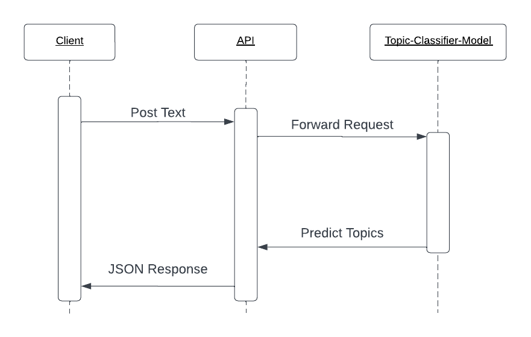
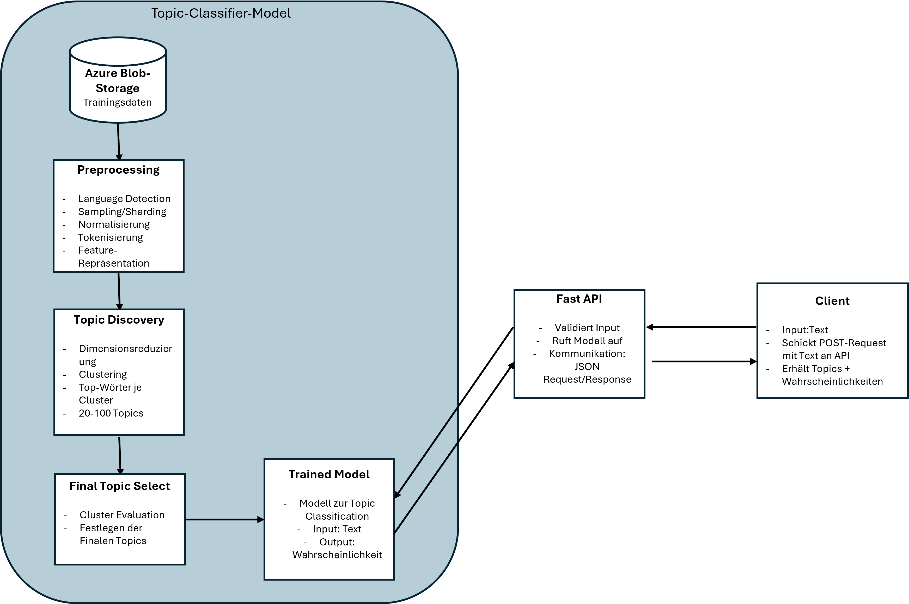

# Instagram Topic Classifier (Dummy Implementation)

Dieses Projekt demonstriert eine **Dummy-Implementierung eines Microservices**, der Text-Content eines Instagram-Posts auf Topics klassifiziert. **Es handelt sich hierbei nicht um ein trainiertes Modell**, sondern um ein Beispiel zur Demonstration der Architektur und API-Integration.

## 📌 Methodik: Topics finden & klassifizieren

- **Preprocessing**:  
  - Language Detection
  - Sampling, Normalisierung, Tokenisierung  
  - Feature-Representation (Embeddings)  

- **Topic Discovery (offline, Batch)**:  
  - Clustering / Dimensionality Reduction (z.B. BERTopic)  
  - Embeddings → Cluster → Topic-Vorschläge  
  - Human-in-the-loop: Auswahl sinnvoller Topics  

- **Klassifikation neuer Posts (online, Microservice)**:  
  - REST API erhält Text-Input  
  - Dummy Topic Model generiert zufällige Wahrscheinlichkeiten  
  - API gibt JSON-Response mit Topic-Wahrscheinlichkeiten zurück  

## 🏗 Architektur

**Cloud Setup (Azure, konzeptionell)**:  

- **Daten & Preprocessing**: Azure Blob Storage + ML Workspace  
- **Modelltraining / Topic Discovery**: Azure ML Workspace  
- **Model Registry**: Versionierung der trainierten Modelle  
- **Online Serving / API**: Azure Container Instance / App Service / AKS  
- **Client**: Sendet POST-Requests, erhält JSON Response  

**Skizze**:

## 🗂 Projektstruktur:

instagram-topic-labler/
│
├── app/
│   ├── __init__.py
│   ├── model.py       # Dummy-Modell, gibt zufällige Wahrscheinlichkeiten für Topics zurück  
│   └── main.py        # REST API: FastAPI-Endpunkt, ruft das Dummy-Modell auf 
│
├── docs/
│   ├── Architekturskizze.png   # Architekturdiagramm
│   └── Sequenzdiagramm.png       # Sequenzdiagramm (Client ↔ API ↔ Modell)
│
├── requirements.txt       # FastAPI, Uvicorn, NumPy 
└── README.md              # Projektbeschreibung & Methodik

---

## How to Run

1. Virtuelle Umgebung erstellen und aktivieren:

cd C:\Users\Simon\instagram-topic-labler #Switch in Projektordner
Set-ExecutionPolicy -ExecutionPolicy RemoteSigned -Scope CurrentUser
py -m venv venv
.\venv\Scripts\activate  # Windows PowerShell

2. Dependcies installieren
pip install -r requirements.txt

3. Rest API starten
uvicorn app.main:app --reload

4. API testen
Zugriff auf Swagger UI: http://127.0.0.1:8000/docs

